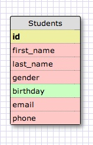
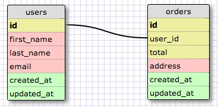
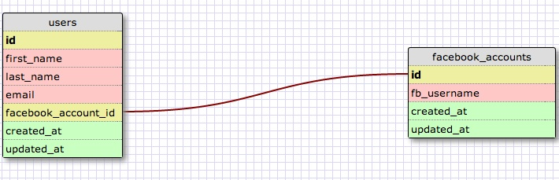
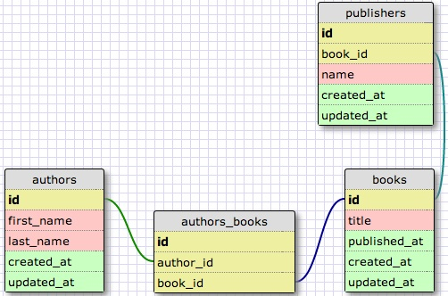
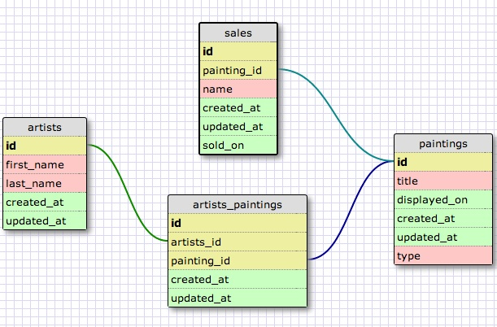
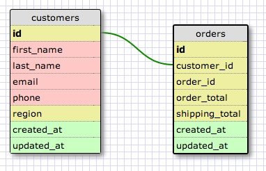

# U3.W7: Designing Schemas

#### I worked on this challenge [by myself, with: Tony Stark]

## Release 0: Student Roster Schema

## Release 1: One to Many Schema

## Release 2: One to One Schema

## Release 3: Many to Many Schema

## Release 4: Design your own Schema
Description of what you're modeling: 
This is a simple modification to the previous Many to Many schema.
In lieu of books I used artists and paintings to achieve the same result. 

Also I created a very simple one-to-one schema modeling a joined users and orders table.

## Release 5: Reflection

### What parts of your strategy worked? What problems did you face?

The most challenging part of this challenge was figuring out how to get the Flippen imgs to display on GitHub
I'm using grab which saves as .tiff turns out there is no real way to display .tiff in GitHub md
Convert to .jpg Move Along. There's 45 minutes I'll never get back.

### What questions did you have while coding? What resources did you find to help you answer them?

See above, ohh and why can't I connect foreign key from order id to id but only from id to order id. Seems like that should be a two way street...

### What concepts are you having trouble with, or did you just figure something out? If so, what?

None. I can click buttons and make screen grabs like a BOSS. So pretty good on this one I think.....

### Did you learn any new skills or tricks?

Yes How to add tiff to md on GitHUB. Answer: you don't convert to jpeg and try again.

### How confident are you with each of the Learning Competencies?

Very confident.

### Which parts of the challenge did you enjoy?

Does clicking commit count?

### Which parts of the challenge did you find tedious?

While I get why this challenge is here. (Repetition of naming conventions and schema design), I did find the entirety of it a bit tedious, not really a lot, just a bit :+)