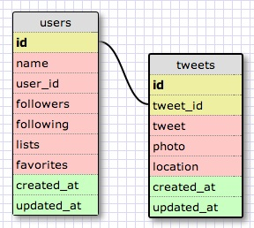

# U3.W7: Modeling a Real-World Database (SOLO CHALLENGE)

## Release 0: Users Fields

Name
User_id
Following
Followers
Tweets
Lists
Favorites

## Release 1: Tweet Fields
<!-- Identify the fields Twitter uses to represent/display a tweet. What are you required or allowed to enter? -->Tweet string
Add photo
Location information

## Release 2: Explain the relationship
The relationship between `users` and `tweets` is: 
<!-- because... -->
This relationship is one-to-many. As there is one user that has many tweets.

## Release 3: Schema Design
<!-- Include your image (inline) of your schema -->


## Release 4: SQL Statements
<!-- Include your SQL Statements. How can you make markdown files show blocks of code? -->

# All user Tweets

```
SELECT user_id, tweet 
FROM twitter
JOIN user ON tweets.tweet_id = user.id
WHERE user_id = "JimBobJoeJunk"
```

# Tweets made after last Wednesday

```
SELECT user_id, tweet 
FROM twitter
JOIN user ON tweets.tweet_id = user.id
WHERE user_id = "JimBobJoeJunk" AND created_at > 2014-04-23
```

# All tweets associated with Twitter Handle

```
SELECT user_id, tweet 
FROM twitter
JOIN user ON tweets.tweet_id = user.id
WHERE user_id = "JimBobJoeJunk"
```

# The twitter handle associated with a tweet_id
```
SELECT user_id
FROM twitter
JOIN user ON tweets.tweet_id = user.id
WHERE tweet_id = "123456"
```

## Release 5: Reflection


I feel like user_id and twitter handle should be the same thing...