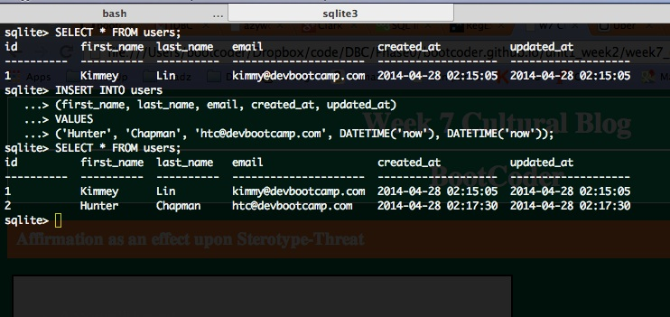
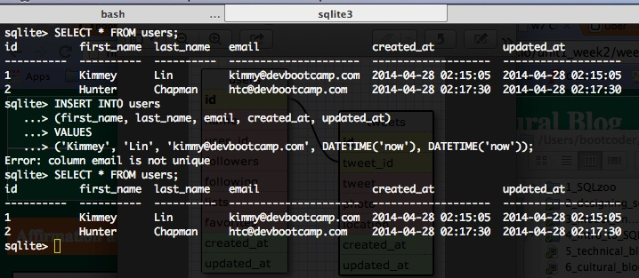
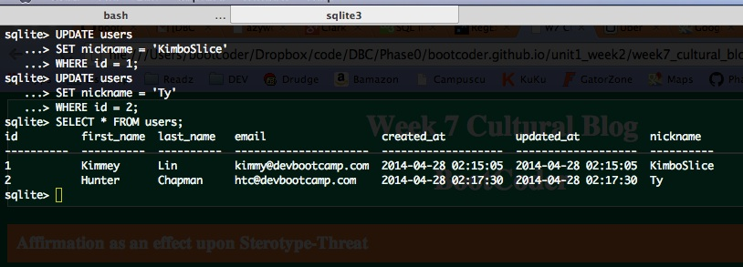
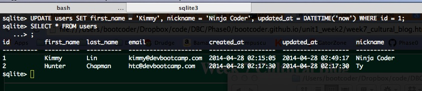

# U3.W7: Intro to SQLite

## Release 0: Create a dummy database
No screen shot. CMD K... It's a love hate thing really.
## Release 1: Insert Data 

## Release 2: Multi-line commands

## Release 3: Add a column

## Release 4: Change a value

## Release 5: Reflect

## What parts of your strategy worked? What problems did you face?

My strategy here was to follow the instructions for the challenge... Sometimes that can be a problem for my personality type.:+) But in this instance it worked out pretty ok.

## What questions did you have while coding? What resources did you find to help you answer them?
None

## What concepts are you having trouble with, or did you just figure something out? If so, what?
None

## Did you learn any new skills or tricks?
None

## How confident are you with each of the Learning Competencies?
VERY

## Which parts of the challenge did you enjoy?
Quick and easy. Super awesome considering the week I've had.

## Which parts of the challenge did you find tedious?
None